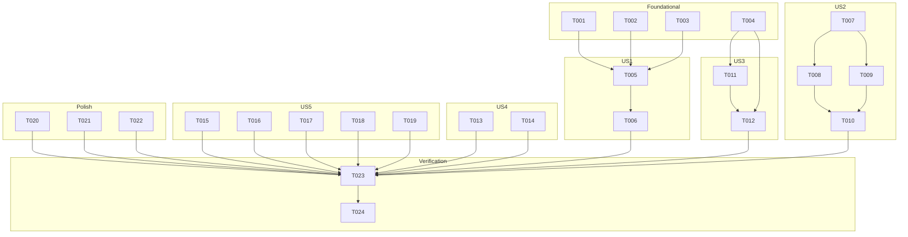

# Tasks: Code Quality Fixes

**Input**: Design documents from `spec/code-quality-fixes/`
**Prerequisites**: plan.md (required), spec.md (required for user stories)

## Format: `[ID] [P?] [Story] Description`

- **[P]**: Can run in parallel (different files, no dependencies)
- **[Story]**: Which user story this task belongs to (US1, US2, US3, US4, US5)

---

## Phase 1: Foundational (Blocking Prerequisites)

**Purpose**: 共享基础设施修改，部分 User Story 依赖

**⚠️ CRITICAL**: 部分 User Story 需要这些基础修改完成后才能开始

- [X] T001 [P] Enable hvigor build optimization options (daemon, incremental, parallel) in `/Users/houyw/luckydog/projects/WebBoard/hvigor/hvigor-config.json5`
- [X] T002 Add color resource entries for all hardcoded color values in `/Users/houyw/luckydog/projects/WebBoard/entry/src/main/resources/base/element/color.json`
- [X] T003 Update `EntryAbility.ets` to load a Navigation-based root that routes to SplashPage, preparing for the US-1 Navigation migration
- [X] T004 Update `EventEmitter.ets` to add `subscribe(eventName, callback): string` and `unsubscribe(id): void` methods with listener ID tracking; keep `on()`/`off()` for backward compatibility

**Checkpoint**: Foundation ready - user story implementation can now begin

---

## Phase 2: User Story 1 - 导航架构统一 (Priority: P1) 🎯 MVP

**Goal**: SplashPage 从废弃的 `router.replaceUrl()` 迁移至 Navigation 体系，使用独立 NavPathStack

**Independent Test**: 启动应用 → 闪屏动画正常播放 → 自动跳转到首页 → 返回键不会回到闪屏

- [X] T005 [US1] Rewrite SplashPage.ets to use NavPathStack with replacePath navigation instead of router.replaceUrl() in `/Users/houyw/luckydog/projects/WebBoard/entry/src/main/ets/pages/SplashPage.ets`
- [X] T006 [US1] Add SplashPage routing registration to the NavPathStack navDestination builder and remove `router` import in `/Users/houyw/luckydog/projects/WebBoard/entry/src/main/ets/entryability/EntryAbility.ets`

**Checkpoint**: User Story 1 complete - SplashPage 使用 Navigation 路由跳转

---

## Phase 3: User Story 2 - WebView 预加载修复 (Priority: P1)

**Goal**: WebPreloader 真正创建隐藏 Web 组件池并加载内容，实现秒开

**Independent Test**: 访问一个本地 HTML 应用 → 返回首页 → 再次点击 → 页面应在 300ms 内显示

- [X] T007 [US2] Rewrite WebPreloader.ets to manage a pool of preload entries with pre-created WebviewController instances and LRU eviction in `/Users/houyw/luckydog/projects/WebBoard/entry/src/main/ets/util/WebPreloader.ets`
- [X] T008 [US2] Create HiddenWebPool component in a new file `/Users/houyw/luckydog/projects/WebBoard/entry/src/main/ets/component/HiddenWebPool.ets` - manages offscreen Web component instances
- [X] T009 [US2] Update ViewerPage.ets to accept and use preloaded WebviewController from WebPreloader instead of always creating a new controller in `/Users/houyw/luckydog/projects/WebBoard/entry/src/main/ets/pages/ViewerPage.ets`
- [X] T010 [US2] Integrate HiddenWebPool into Index.ets and update preloadRecentApps to trigger actual Web loading in `/Users/houyw/luckydog/projects/WebBoard/entry/src/main/ets/pages/Index.ets`

**Checkpoint**: User Story 2 complete - 最近访问的 HTML 应用可秒开

---

## Phase 4: User Story 3 - EventEmitter 监听器管理修复 (Priority: P1)

**Goal**: EventEmitter 支持按注册句柄精确移除监听器，避免误清其他组件的监听

**Independent Test**: 两个组件同时监听同一事件，一个组件卸载时不影响另一个的监听

- [X] T011 [US3] Implement `subscribe()`/`unsubscribe(id)` + internal listener entry tracking in `/Users/houyw/luckydog/projects/WebBoard/entry/src/main/ets/common/EventEmitter.ets`
- [X] T012 [US3] Update Index.ets to use `subscribe()`/`unsubscribe()` instead of `on()`/`off()` for precise lifecycle management in `/Users/houyw/luckydog/projects/WebBoard/entry/src/main/ets/pages/Index.ets`

**Checkpoint**: User Story 3 complete - 跨页面事件监听器精确管理

---

## Phase 5: User Story 4 - Dialog/Loading 组件可靠性修复 (Priority: P1/P2)

**Goal**: Dialog 使用 `@Component` + `ComponentContent` 替代全局变量模式，Loading 替换废弃 wrapBuilder

**Independent Test**: 依次调用两次 Dialog.confirm() 带不同内容，第二次弹窗正确显示新内容

- [X] T013 [P] [US4] Rewrite DialogUtil.ets to use `@Component` struct for DialogContent + `ComponentContent` for content update support in `/Users/houyw/luckydog/projects/WebBoard/entry/src/main/ets/ui/DialogUtil.ets`
- [X] T014 [P] [US4] Update LoadingUtil.ets to replace `wrapBuilder()` with direct builder function reference for API 12+ in `/Users/houyw/luckydog/projects/WebBoard/entry/src/main/ets/ui/LoadingUtil.ets`

**Checkpoint**: User Story 4 complete - Dialog 和 Loading 组件使用最新的可靠实现

---

## Phase 6: User Story 5 - 代码清理与质量优化 (Priority: P3)

**Goal**: 清理死代码、统一日志、修复 ViewerPage 返回逻辑、消除硬编码颜色、优化 Index.ets

**Independent Test**: 编译无告警通过，日志格式一致，ViewerPage 返回行为正确

- [X] T015 [P] [US5] Remove dead code `EventMap` export from `/Users/houyw/luckydog/projects/WebBoard/entry/src/main/ets/common/EventEmitter.ets`
- [X] T016 [P] [US5] Rewrite Logger.ets to use `@kit.PerformanceAnalysisKit` hilog instead of `console.x` in `/Users/houyw/luckydog/projects/WebBoard/entry/src/main/ets/common/Logger.ets`
- [X] T017 [P] [US5] Merge ViewerPage.ets back press logic — consolidate `handleBackPress()` into `onBackPressed()` callback, remove duplicate logic in `/Users/houyw/luckydog/projects/WebBoard/entry/src/main/ets/pages/ViewerPage.ets`
- [X] T018 [P] [US5] Extract shared logic (shareAppCard, deleteDirectory, startScan) from Index.ets into a new utility file `/Users/houyw/luckydog/projects/WebBoard/entry/src/main/ets/util/IndexActions.ets`
- [X] T019 [US5] Normalize all hardcoded color values in Index.ets, ViewerPage.ets, EditPage.ets, AppShareCard.ets to use `$r('app.color.xxx')` resource references from updated color.json

**Checkpoint**: User Story 5 complete - 代码质量全面优化

---

## Phase 7: Polish & Cross-Cutting Concerns

**Purpose**: 收尾清理，确保无遗留问题

- [X] T020 [P] Update code-linter.json5 rules if needed and run lint check
- [X] T021 [P] Remove unused imports from all modified files
- [X] T022 Update spec/feature.json to point to spec/code-quality-fixes

---

## Phase 8: Verification

<!-- verification_scope: build-only -->

**Purpose**: 构建验证确保所有修改编译通过

- [X] T023 Build project and fix any compilation errors (invoke build_project; iterate fix → build until success)
- [X] T024 Deploy application to device/emulator (invoke start_app)

---

## Path Conventions

- **Project root**: `/Users/houyw/luckydog/projects/WebBoard`
- **Source code**: `entry/src/main/ets/`
- **Resources**: `entry/src/main/resources/`
- **Configuration**: `/hvigor/hvigor-config.json5`, `/build-profile.json5`
- **Spec artifacts**: `spec/code-quality-fixes/`

---

## Dependencies & Execution Order

### Phase Dependencies

- **Foundational (Phase 1)**: No dependencies — all 4 tasks can start in parallel
- **User Story 1 (Phase 2)**: Depends on T003 (EntryAbility Navigation container)
- **User Story 2 (Phase 3)**: Depends on Foundational completion
- **User Story 3 (Phase 4)**: Depends on T004 (EventEmitter foundation)
- **User Story 4 (Phase 5)**: Depends on Foundational completion
- **User Story 5 (Phase 6)**: Most tasks independently parallel; T019 depends on T002 (color resources)
- **Polish (Phase 7)**: Depends on all Phase 2-6 completion
- **Verification (Phase 8)**: Depends on Polish completion

### User Story Dependencies

- **US-1** (P1): Can start after T003 (EntryAbility Navigation container setup)
- **US-2** (P1): Can start independently after Foundational
- **US-3** (P1): Can start after T004 (EventEmitter foundation)
- **US-4** (P1-P2): Fully independent, can start in parallel with US-1, US-2, US-3
- **US-5** (P3): Mostly independent, can start in parallel with US-1/2/3/4

### Parallel Opportunities

- Foundational Phase: All 4 tasks in parallel
- US-4: Tasks can run in parallel
- US-5: T015, T016, T017, T018 can all run in parallel
- All User Stories can run in parallel once Foundational is complete

---

## Parallel Example

```bash
# Launch all Foundational tasks in parallel:
Task: "T001 [P] Enable hvigor build optimization options"
Task: "T002 [P] Add color resource entries"
Task: "T003 [P] Update EntryAbility"
Task: "T004 [P] Update EventEmitter foundation"

# Launch US-4 tasks in parallel:
Task: "T013 [P] [US4] Rewrite DialogUtil"
Task: "T014 [P] [US4] Update LoadingUtil"

# Launch US-5 cleanup tasks in parallel:
Task: "T015 [P] [US5] Remove EventMap dead code"
Task: "T016 [P] [US5] Rewrite Logger"
Task: "T017 [P] [US5] Merge ViewerPage back press"
Task: "T018 [P] [US5] Extract IndexActions utility"
```

---

## Implementation Strategy

### MVP First (User Story 1 Only)

1. Complete Phase 1: Foundational
2. Complete Phase 2: User Story 1 — SplashPage Navigation migration
3. **STOP and VALIDATE**: Test splash → Index navigation works correctly
4. Proceed to remaining stories

### Incremental Delivery

1. Complete Foundational → Foundation ready
2. Add US-1 (SplashPage) → Test → P1 done
3. Add US-2 (WebPreloader) → Test → P1 done
4. Add US-3 (EventEmitter) → Test → P1 done
5. Add US-4 (Dialog/Loading) → Test → P1-P2 done
6. Add US-5 (Code cleanup) → Test → P3 done
7. Polish + Verification → Final validation
8. Each story is independently testable without breaking previous ones

---

## Notes

- [P] tasks = different files, no dependencies
- Tasks within each user story should be executed in order (not parallel) when they modify the same file
- US-2's HiddenWebPool (T008) is a new file — no dependency conflicts
- T019 (hardcoded color normalization) touches files modified by other US tasks — coordinate to avoid merge conflicts
- Logger.ets rewrite (T016) will affect all files using Logger — run lint check after to ensure all imports are updated
- Verification phase is build-only per user selection

---

## 📊 Dependency Graph



## ⚡ Parallel Execution Guide

| Phase | Tasks | Required Files | Notes |
|-------|-------|---------------|-------|
| Foundational | T001, T002, T003, T004 | hvigor-config.json5, color.json, EntryAbility.ets, EventEmitter.ets | All 4 in parallel |
| US1 | T005, T006 | SplashPage.ets, EntryAbility.ets | Sequential (T005→T006) |
| US2 | T007, T008, T009, T010 | WebPreloader.ets, HiddenWebPool.ets, ViewerPage.ets, Index.ets | T007+T008 parallel; then T009+T010 after |
| US3 | T011, T012 | EventEmitter.ets, Index.ets | Sequential (T011→T012) |
| US4 | T013, T014 | DialogUtil.ets, LoadingUtil.ets | Parallel |
| US5 | T015, T016, T017, T018, T019 | EventEmitter.ets, Logger.ets, ViewerPage.ets, IndexActions.ets, color.json, + 4 page files | T015-018 parallel; T019 depends on T002 |
| Polish | T020, T021, T022 | All modified files | Parallel |
| Verification | T023, T024 | Build output | Sequential |


