# Tasks: JSBridge 平台安全增强与 SDK 标准化

**Input**: Design documents from `spec/jsbridge-platform-enhancement/`
**Prerequisites**: plan.md, spec.md

## Format: `[ID] [P?] [Story] Description`

- **[P]**: Can run in parallel (different files, no dependencies)
- **[Story]**: Which user story this task belongs to (e.g., US1, US2, US3)
- Include exact file paths in descriptions

## Path Conventions

- `PROJECT_ROOT` = `/Users/houyw/luckydog/projects/WebBoard`
- `container/` = `{PROJECT_ROOT}/container/`
- `entry/` = `{PROJECT_ROOT}/entry/`

---

## Phase 1: Foundational — JSBridge Native Layer (JSBridge.ets)

**Purpose**: Add permission system, error codes, getVersion/hasMethod, and sourceType support to the native JSBridge class

- [X] T001 [US1] Add `SourceType` type (`'rawfile' | 'file' | 'url'`) and standard error code strings to `container/src/main/ets/webview/JSBridge.ets`
- [X] T002 [US1] Add `sourceType` constructor parameter to `JSBridge` class in `container/src/main/ets/webview/JSBridge.ets`; store as private `this.sourceType`
- [X] T003 [US1] Add `getPermissionMap()` private method returning `Record<string, 'allow'|'deny'>` based on `this.sourceType`:
  - `rawfile`: all methods `'allow'`
  - `file`/`url`: `vibrate`/`systemShare`/`systemImagePick` → `'deny'`, rest → `'allow'`
- [X] T004 [US1] Add `checkPermission(method): boolean` private method using `getPermissionMap()`
- [X] T005 [US1] Modify `handleCall()` in `container/src/main/ets/webview/JSBridge.ets`:
  - Before the `switch` statement, call `checkPermission(method)`
  - If denied → `this.callback(callId, { status: 'error', code: 'PERMISSION_DENIED', message: '方法在当前来源下不可用' })` and return
- [X] T006 [US2] Add `handleGetVersion(callId)` and `handleHasMethod(params, callId)` private methods to `container/src/main/ets/webview/JSBridge.ets`:
  - `getVersion` returns `{ sdk: '1.0.0', container: '1.0.0', api: 1 }`
  - `hasMethod` checks `params.name` against known method list
- [X] T007 [US2] Add `case 'getVersion'` and `case 'hasMethod'` to `handleCall()` switch
- [X] T008 [US3] Standardize all error responses in `container/src/main/ets/webview/JSBridge.ets`:
  - Replace all `{ status: 'error', error: '...' }` with `{ status: 'error', code: 'INTERNAL_ERROR', message: '...', error: '...' }`
  - Add specific codes: `USER_CANCELLED` for share dismiss, `INVALID_PARAMS` for parse errors, `METHOD_NOT_FOUND` for unknown methods
- [X] T009 [US1] Extend `GetAppInfoResult` in `container/src/main/ets/webview/JSBridge.ets` with `sdkVersion: string` field, populate in `handleGetAppInfo`

---

## Phase 2: Foundational — WebContainer Layer (WebContainer.ets)

**Purpose**: Add sourceType detection, push events, and debug mode to the reusable WebView component

- [X] T010 [US1] Add `getSourceType(): SourceType` private method to `container/src/main/ets/webview/WebContainer.ets`:
  - `rawfile://` prefix → `'rawfile'`
  - `http://` or `https://` → `'url'`
  - else → `'file'`
- [X] T011 [US1] Pass `sourceType` to `JSBridge` constructor in `setupJSBridge()`: `new JSBridge(this.controller, this.context, this.getSourceType())`
- [X] T012 [US4] Add `onPageShow()` lifecycle callback to `container/src/main/ets/webview/WebContainer.ets`:
  - Dispatch `window.dispatchEvent(new CustomEvent('WebLeafForeground'))` via `this.controller.runJavaScript()`
- [X] T013 [US4] Extend `aboutToDisappear()` in `container/src/main/ets/webview/WebContainer.ets`:
  - Before `clearHistory()`, dispatch `window.dispatchEvent(new CustomEvent('WebLeafBackground'))` via `this.controller.runJavaScript()`
- [X] T014 [US6] Add `@Prop debugEnabled: boolean = false` to `container/src/main/ets/webview/WebContainer.ets`
- [X] T015 [US6] In `onPageBegin()`, after SDK injection, check `this.debugEnabled || this.src.includes('wldebug=1')`:
  - If true, inject debug intercept script via `runJavaScript()` that wraps `window.JSBridge.call` to log all requests/responses to console

---

## Phase 3: User Story 1 & 2 — webleaf-sdk Enhancement

**Purpose**: Update both SDK copies (embedded .ets and rawfile .js) with version introspection, timeout, callback cap, and iframe support

- [X] T016 [US2] Update `container/src/main/ets/webview/webleaf-sdk.ets` — add to `window.webLeaf`:
  - `getVersion()` → calls `_call('getVersion')`
  - `hasMethod(name)` → calls `_call('hasMethod', { name })`
- [X] T017 [US2] Update `container/src/main/ets/webview/webleaf-sdk.ets` — add `sdkVersion` to `getAppInfo` response display (handled by native side in T009; update comment)
- [X] T018 [US3] Update `container/src/main/ets/webview/webleaf-sdk.ets` — add standard error handling:
  - In `_call()`, replace generic `new Error(response.error)` with standard error with `code` and `message`
  - Error object created with `err.code` and `err.message` for consistent error handling
- [X] T019 [US3] Update `container/src/main/ets/webview/webleaf-sdk.ets` — add 30-second timeout:
  - In `_call()`, use `setTimeout` to reject with `{ code: 'TIMEOUT' }` after 30000ms
- [X] T020 [US5] Update `container/src/main/ets/webview/webleaf-sdk.ets` — add callback leak protection:
  - Add `MAX_CALLBACKS: 500` to `window.JSBridge`
  - In `call()`, if `Object.keys(_callbacks).length >= 500`, delete oldest 100 entries
- [X] T021 [US5] Update `container/src/main/ets/webview/webleaf-sdk.ets` — add iframe security block:
  - After defining `window.webLeaf`, add `try { if (window !== window.top) { delete window.JSBridgeHandle; delete window.JSBridge; delete window.webLeaf; delete window.__JSBridgeCallback__; } } catch(e) {}`
  - Cross-origin iframes are naturally blocked by same-origin policy; this covers same-origin iframes
- [X] T022 [US2][US3][US5] Sync `entry/src/main/resources/rawfile/webleaf-sdk.js` with all changes from `webleaf-sdk.ets` (content must match exactly, just in different format)

---

## Phase 4: Polish — Test Page & Documentation

- [X] T023 [P] Update `entry/src/main/resources/rawfile/jsbridge_test.html` — add debug mode toggle button (appends `?wldebug=1` or calls webContainer prop), add version display card showing `webLeaf.getVersion()` result
- [X] T024 [P] Update `container/src/main/ets/webview/webleaf-sdk.ets` version constant to `'1.0.0'` (synchronized with getVersion response)

---

## Phase 5: Verification

<!-- verification_scope: build-only -->

**Purpose**: Build and deploy to verify compilation

- [x] T025 Build project and fix any compilation errors (invoke `build_project`; iterate fix → build until success)
- [x] T026 Deploy application to real device HUAWEI Pura 80 Pro+ (invoke `start_app`)

---

## 📊 Dependency Graph

```mermaid
graph TD
    T001 --> T002
    T002 --> T003
    T003 --> T004
    T004 --> T005
    T005 --> T006
    T006 --> T007
    T007 --> T008
    T008 --> T009
    T009 --> T010
    T010 --> T011
    T011 --> T012
    T012 --> T013
    T013 --> T014
    T014 --> T015
    T015 --> T016
    T016 --> T017
    T017 --> T018
    T018 --> T019
    T019 --> T020
    T020 --> T021
    T021 --> T022
    T022 --> T023
    T023 --> T024
    T024 --> T025
    T025 --> T026
```



## ⚡ Parallel Execution Guide

| Phase | Tasks | Required Files | Notes |
|-------|-------|---------------|-------|
| Foundational (JSBridge) | T001–T009 | JSBridge.ets | Sequential — each builds on the last |
| Foundational (WebContainer) | T010–T015 | WebContainer.ets | T010→T011→T012→T013→T014→T015 sequential |
| SDK | T016–T022 | webleaf-sdk.ets, webleaf-sdk.js | T016→T017→T018→T019→T020→T021→T022 sequential |
| Polish | T023–T024 | jsbridge_test.html, webleaf-sdk.ets | [P] Can run in parallel |

## Dependencies & Execution Order

### Phase Dependencies

- **Phase 1 (JSBridge.ets)**: No dependencies — foundational layer
- **Phase 2 (WebContainer.ets)**: Depends on Phase 1 completion (needs sourceType-aware JSBridge)
- **Phase 3 (webleaf-sdk)**: Depends on Phase 1 completion (needs getVersion/hasMethod handlers in native layer)
- **Phase 4 (Polish)**: Depends on all phases, modifications to rawfile test page
- **Phase 5 (Verification)**: Depends on all previous phases

### Task Dependencies

- T001→T002→T003→T004→T005 (permission chain)
- T006→T007 (version/hasMethod chain)
- T010→T011 (sourceType → pass to JSBridge)
- T016→T017→T018→T019→T020→T021→T022 (SDK enhancement chain)

---

## Parallel Example: Phase 1 & Phase 4

```bash
# Phase 1 and Phase 4 can overlap when independent work is done:
# Run T001 through T009 (JSBridge native layer)
# In parallel, run T023-T024 (test page/doc updates)
```

---

## Notes

- All changes to `webleaf-sdk.ets` must be **exactly mirrored** in `webleaf-sdk.js`
- No breaking changes to existing H5 pages — all enhancements are additive
- Permission check overhead should be < 1ms per call
- SourceType detection is based on the `src` URL prefix at WebContainer initialization
- Debug mode can be activated via `@Prop debugEnabled={true}` or by adding `?wldebug=1` to the app URL
- The `WebLeafForeground` event fires on each `onPageShow()` call (including first appearance)

### Full Delivery (all stories)
1. Phase 1 (JSBridge native layer: permissions, version, error codes)
2. Phase 2 (WebContainer: sourceType, push events, debug mode)
3. Phase 3 (SDK: getVersion, timeout, callback cap, iframe)
4. Phase 4 (Polish)
5. Phase 5 (Verification)

## Summary Report

| Metric | Count |
|--------|-------|
| **Total tasks** | 26 |
| **Phase 1 (JSBridge.ets)** | 9 |
| **Phase 2 (WebContainer.ets)** | 6 |
| **Phase 3 (webleaf-sdk)** | 7 |
| **Phase 4 (Polish)** | 2 |
| **Phase 5 (Verification)** | 2 |
