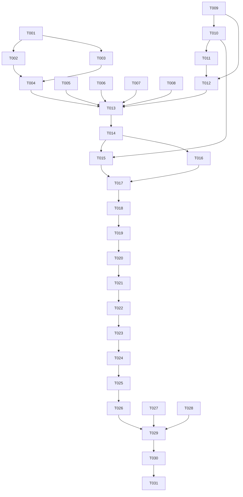

# Tasks: 浮叶（WebLeaf）平台容器化与轻应用分发重构

**Input**: Design documents from `spec/platform-container-refactor/`
**Prerequisites**: plan.md, spec.md

## Format: `[ID] [P?] [Story] Description`

- **[P]**: Can run in parallel (different files, no dependencies)
- **[Story]**: Which user story this task belongs to (e.g., US1, US2, US3)
- Include exact file paths in descriptions

## Path Conventions

- `PROJECT_ROOT` = `/Users/houyw/luckydog/projects/WebBoard`
- `entry/` = `{PROJECT_ROOT}/entry/`
- `container/` = `{PROJECT_ROOT}/container/` (new HSP module)

---

## Phase 1: Setup (HSP Module & Config)

**Purpose**: Create the container HSP module directory structure and configure multi-module build system

- [X] T001 Create container HSP module directory structure: `container/hvigorfile.ts`, `container/oh-package.json5`, `container/src/main/module.json5` with `"type": "shared"`
- [X] T002 [P] Add container module registration to root `build-profile.json5` (under `modules` array)
- [X] T003 [P] Add `"container": "file:../container"` dependency to `entry/oh-package.json5`

---

## Phase 2: Foundational (Code Migration & WebContainer)

**Purpose**: Migrate all container-specific code from entry module to container HSP module; create WebContainer component; build Index.ets facade

### Code Migration

- [X] T004 Move `entry/src/main/ets/database/DatabaseManager.ets` → `container/src/main/ets/database/DatabaseManager.ets`
- [X] T005 [P] Move `entry/src/main/ets/model/` (WebAppItem.ets, AppDataSource.ets) → `container/src/main/ets/model/`
- [X] T006 [P] Move `entry/src/main/ets/common/` (EventEmitter.ets, Logger.ets, Constants.ets) → `container/src/main/ets/common/`
- [X] T007 [P] Move `entry/src/main/ets/ui/` (ToastUtil.ets, LoadingUtil.ets, DialogUtil.ets) → `container/src/main/ets/ui/`
- [X] T008 [P] Move `entry/src/main/ets/util/` (WebPreloader.ets, FileManager.ets, WorkDirectory.ets) → `container/src/main/ets/util/`
- [X] T009 Move and refactor `entry/src/main/ets/util/JSBridge.ets` → `container/src/main/ets/webview/JSBridge.ets` (update import paths to use `../common/Logger`)

### WebContainer & Facade

- [X] T010 Create `container/src/main/ets/webview/WebContainer.ets`: reusable `@Component` struct encapsulating:
  - `Web({ src, controller })` with javaScriptAccess, mixedMode, domStorageAccess, cacheMode
  - JSBridge lifecycle (`initJSBridge`, `onControllerAttached`, cleanup)
  - Loading progress bar + error/retry UI
  - Back press triage (Web history → JSBridge callback → navigateBack)
  - Exposes `@Prop src: string` and `@Prop appName: string`
  - Does NOT include NavDestination wrapper
- [X] T011 [US2] Create `webleaf-sdk.js` as embedded string constant in `container/src/main/ets/webview/webleaf-sdk.ets`:
  - Promise-based wrapper over `window.JSBridgeHandle.call()`
  - All 8 methods: getAppInfo, modifyNavStyle, systemShare, systemImagePick, vibrate, onBackPress, navigateBack, call
  - Auto-injects via `this.controller.runJavaScript()` in `onPageBegin` callback of `WebContainer.ets`
  - Backward compatible — existing `window.JSBridge` / `window.JSBridgeHandle` code unaffected
- [X] T012 Create `container/src/main/ets/Index.ets` facade re-exporting all public APIs:
  - WebContainer, AppShareCard
  - DatabaseManager
  - WebAppItem, WebAppRecord, AppDataSource
  - Toast, Loading, Dialog
  - Logger, eventEmitter, Constants (WebBoardConstants, ColorMode, LayoutMode, LogoType, SourceType)
  - WebPreloader, FileManager, WorkDirectory, JSBridge

### Entry Import Rewiring

- [X] T013 [P] Update `entry/src/main/ets/model/` — remove local copies, replace with `export * from 'container'` re-exports (or directly import from container in all pages)
- [X] T014 Update all entry pages to use `import { ... } from 'container'`:
  - `entry/src/main/ets/pages/Index.ets`
  - `entry/src/main/ets/pages/ImportPage.ets`
  - `entry/src/main/ets/pages/ViewerPage.ets`
  - `entry/src/main/ets/pages/EditPage.ets`
  - `entry/src/main/ets/pages/SettingsPage.ets`
- [X] T015 Refactor `entry/src/main/ets/pages/ViewerPage.ets` to use `WebContainer` from container HSP (simplified to just NavDestination wrapping WebContainer)
- [X] T016 Remove old files from `entry/src/main/ets/` that have been migrated: database/, model/, common/ (except AGENTS.md references), ui/, util/JSBridge.ets, util/WebPreloader.ets, util/FileManager.ets, util/WorkDirectory.ets

**Checkpoint**: Foundation ready — project compiles with entry HAP depending on container HSP

---

## Phase 3: User Story 1 — 轻应用市场 (Priority: P1) 🎯 MVP

**Goal**: Entry 首页增加"轻应用市场"标签页，展示两个内置 rawfile 演示应用（JSBridge 测试、速算估算微练），用户可点击添加至本地列表。

**Independent Test**: 进入首页，切换到"轻应用市场"标签，看到两个演示应用卡片。点击"添加"按钮，应用出现在本地列表中，点击可打开 WebView 正常加载。

### Implementation

- [X] T017 [P] [US1] Add static market data source — define two demo app entries in `entry/src/main/ets/pages/Index.ets` referencing `rawfile://jsbridge_test.html` and `rawfile://code_artifact.html`
- [X] T018 [US1] Add "轻应用市场" tab/section to Index.ets — implement Tab/Toggle switching between "本地应用" and "应用市场" views
- [X] T019 [US1] Render market app cards with name, description, source badge ("演示"), and "添加" button
- [X] T020 [US1] Implement "添加" action: create WebAppItem with sourceType='preset', save to DB via DatabaseManager, refresh local app list, show success Toast
- [X] T021 [US1] Implement "已添加" state: if market app already exists in local list, show "打开" button instead of "添加"

**Checkpoint**: User Story 1 fully functional — market discovery → add → launch flow works end-to-end

---

## Phase 4: User Story 2 — JSBridge SDK (Priority: P2)

**Goal**: H5 开发者可通过标准 `window.webLeaf` Promise API 调用原生能力，无需手动引用 JS 文件。

**Independent Test**: 加载任意 H5 页面（包括 rawfile 中的 jsbridge_test.html），在 JS 控制台执行 `window.webLeaf.getAppInfo().then(console.log)`，收到格式规范的 JSON 数据。

### Implementation

> NOTE: T011 created the SDK script and T010 integrated it into WebContainer.ets. This phase focuses on verification and documentation.

- [X] T022 [P] [US2] Verify webleaf-sdk auto-injection works — add test log in `WebContainer.ets` `onPageBegin` callback confirming `runJavaScript` executed
- [X] T023 [P] [US2] Create standalone `spec/platform-container-refactor/webleaf-sdk.js` — extractable, publishable JS SDK file with TypeScript JSDoc annotations for external H5 developers
- [X] T024 [US2] Verify backward compatibility: existing `window.JSBridgeHandle.call()` usage in `jsbridge_test.html` must continue to work unchanged

**Checkpoint**: User Story 2 verified — `window.webLeaf` ready event fires, all Promise APIs resolve successfully

---

## Phase 5: Polish & Cross-Cutting Concerns

- [X] T025 [P] Update `docs/README.md` to document new multi-module architecture (entry HAP + container HSP)
- [X] T026 [P] Update `AGENTS.md` to reflect container HSP module and JSBridge SDK dual-track
- [X] T027 [P] Clean up unused imports across all entry page files
- [X] T028 [P] Verify no broken import paths in entry pages after migration

---

## Phase 6: Verification

<!-- verification_scope: build+ui -->

**Purpose**: Build, deploy, and UI-verify the implemented feature

- [x] T029 Build project and fix any compilation errors (invoke `build_project`; iterate fix → build until success)
- [x] T030 Deploy application to real device HUAWEI Pura 80 Pro+ (invoke `start_app`)
- [x] T031 Run UI verification against deployed application:
  - US1: Verify "轻应用市场" tab displays, add demo app, launch it
  - US2: Verify jsbridge_test.html loads with `window.webLeaf` available
  - US3: Verify Settings page shows version dynamically
  - Verify existing features unchanged: import, edit, delete, scan, search, settings

---

## 📊 Dependency Graph



---

## Dependencies & Execution Order

### Phase Dependencies

- **Phase 1 (Setup)**: No dependencies — start immediately
- **Phase 2 (Foundational)**: Depends on Setup completion — BLOCKS all user stories
- **Phase 3 (US1 - P1)**: Depends on Foundational completion — can start immediately after
- **Phase 4 (US2 - P2)**: Depends on Foundational (WebContainer) — can run in parallel with US1
- **Phase 5 (Polish)**: Depends on all user stories being complete
- **Phase 6 (Verification)**: Depends on Polish completion

### User Story Dependencies

- **US1 (P1)**: T017→T018→T019→T020→T021 — sequential within the story
- **US2 (P2)**: T022→T023→T024 — sequential, verification and docs

### Within Each User Story

- Core implementation before verification
- Story validation before moving to next

---

## Parallel Example: User Story 1

```bash
# Execute all US1 tasks sequentially (data → UI → action):
Task T017: Define market data in Index.ets
Task T018: Add market tab/view to Index.ets
Task T019: Render market cards in Index.ets
Task T020: Implement "添加" action
Task T021: Implement "已添加" state
```

---

## ⚡ Parallel Execution Guide

| Phase | Tasks | Required Files | Execution Notes |
|-------|-------|---------------|----------------|
| Setup | T002, T003 | `build-profile.json5`, `entry/oh-package.json5` | Can run in parallel after T001 |
| Foundational (Migration) | T005, T006, T007, T008 | Model, common, ui, util directories | All independent file moves |
| Foundational (Migration) | T009, T012 | JSBridge.ets, Index.ets | T009 must complete before T012 |
| Foundational (Migration) | T013, T014, T015 | All entry page files | Sequential due to import chain |
| User Stories | T017, T022, T023 | Index.ets, WebContainer.ets, webleaf-sdk.js | Core migration (T016) needed first |
| Polish | T025, T026, T027, T028 | docs/, AGENTS.md, all page files | All independent |

## Summary Report

| Metric | Count |
|--------|-------|
| **Total tasks** | 31 |
| **Setup** | 3 |
| **Foundational** | 13 |
| **User Story 1 (P1)** | 5 |
| **User Story 2 (P2)** | 3 |
| **Polish** | 4 |
| **Verification** | 3 |
| **Parallel tasks** | 12 |
| **Sequential phases** | 6 |

## Delivery Strategy

### MVP (User Story 1 Only)
1. Phase 1 (Setup) → Phase 2 (Foundational) → Phase 3 (US1) → Phase 5 (Polish) → Phase 6 (Verification)
2. Deliverable: Working app with container separated and light app market functional

### Full Delivery
3. Add Phase 4 (US2 — JSBridge SDK) after US1 is verified
4. Re-run Phase 6 (Verification) for final validation

## Notes

- All container HSP module files use path prefix `container/src/main/ets/`
- All entry module files use path prefix `entry/src/main/ets/`
- Container HSP type must be `"shared"` in `module.json5`
- Entry must declare `"container": "file:../container"` in `oh-package.json5`
- After migration, rebuild required to verify HSP linkage
- `build-profile.json5` `modules` array must list both `entry` and `container`
