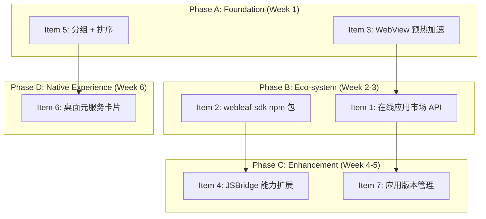

# Development Roadmap: WebBoard Platform v2 (Items 1-7)

> **Status**: Planning  
> **Scope**: Items 1 through 7 (Items 8-10 deferred)

---

## Dependency Map



---

## Item 1: 在线应用市场 API 基础

**Goal**: 让用户能发现和安装来自远程服务器的 HTML 应用，实现真正的内容分发。

**Target**: `entry/src/main/ets/market/` (new module)

### Technical Approach

```
┌─────────────────────────────────────────┐
│            MarketService.ets            │
│  GET /api/apps?page=1                   │
│  GET /api/apps/:id                      │
│  Cache: 本地缓存 24h (JSON)              │
└──────────────────┬──────────────────────┘
                   │
┌──────────────────▼──────────────────────┐
│          MarketDataSource.ets           │
│  - 拉取远程列表 → 合并本地已安装状态       │
│  - 分页加载（每页 20 条）                 │
│  - 搜索结果过滤                          │
└──────────────────┬──────────────────────┘
                   │
┌──────────────────▼──────────────────────┐
│           MarketPage.ets                │
│  - 精选推荐 Tab                         │
│  - 分类浏览 Tab                         │
│  - 搜索                                 │
│  - 卡片 + "安装" / "打开" 按钮           │
└─────────────────────────────────────────┘
```

### Data Contract (Server API)

```json
GET /api/apps
{
  "code": 0,
  "data": {
    "items": [
      {
        "id": "2048",
        "name": "2048",
        "description": "经典数字拼图游戏",
        "icon": "https://cdn.example.com/2048/icon.png",
        "url": "https://cdn.example.com/2048/index.html",
        "category": "game",
        "version": "1.0.0",
        "size": "2.5KB",
        "downloads": 1024,
        "created_at": "2026-07-01"
      }
    ],
    "total": 50,
    "page": 1,
    "page_size": 20
  }
}
```

### Files to Create/Modify
| File | Action |
|------|--------|
| `entry/src/main/ets/market/MarketService.ets` | CREATE — HTTP requests + cache |
| `entry/src/main/ets/market/MarketDataSource.ets` | CREATE — data fetch + merge with local |
| `entry/src/main/ets/market/MarketCard.ets` | CREATE — market app card component |
| `entry/src/main/ets/market/MarketPage.ets` | CREATE — full market page with tabs |
| `entry/src/main/ets/pages/Index.ets` | MODIFY — add MarketPage as third tab |
| `entry/src/main/resources/base/element/string.json` | MODIFY — add market strings |

### Dependencies
- Item 3 (WebView 预热) — optional, for faster online app launch
- None blocking — can start immediately

### Effort: ~5 days

---

## Item 2: webleaf-sdk npm 包 + TypeScript 类型

**Goal**: 让 H5 前端开发者通过 npm 安装 `webleaf-sdk`，获得完整的 TypeScript 类型提示。

**Target**: `webleaf-sdk/` (new directory at PROJECT_ROOT)

### Technical Approach

```
webleaf-sdk/
├── package.json              # name: "webleaf-sdk", main: "dist/index.js"
├── tsconfig.json
├── src/
│   ├── index.ts              # 入口：导出所有类型和 webLeaf 对象类型声明
│   ├── types.ts              # 接口定义：GetAppInfoResult, ShareParams, etc.
│   └── sdk.ts                # 运行时 JS 注入逻辑（可选，用于非自动注入环境）
├── dist/
│   ├── index.js              # 构建产物
│   └── index.d.ts            # 类型声明
├── examples/
│   └── basic-usage.html      # 使用示例
└── README.md                 # API 文档 + 快速开始
```

```typescript
// src/types.ts — 给 H5 开发者使用的类型声明
export interface WebLeafSDK {
  getAppInfo(): Promise<GetAppInfoResult>
  modifyNavStyle(style: number, title?: string): Promise<void>
  systemShare(params: ShareParams): Promise<ShareResult>
  systemImagePick(params: ImagePickParams): Promise<PhotoItem[]>
  vibrate(params: VibrateParams): Promise<void>
  onBackPress(): Promise<void>
  navigateBack(): Promise<void>
  getVersion(): Promise<VersionInfo>
  hasMethod(name: string): Promise<{ available: boolean }>
  call(method: string, params?: object): Promise<any>
}

// 扩展全局 Window 类型
declare global {
  interface Window {
    webLeaf: WebLeafSDK
    JSBridge: any
    JSBridgeHandle: any
  }
}
```

### Files to Create
| File | Action |
|------|--------|
| `webleaf-sdk/package.json` | CREATE |
| `webleaf-sdk/tsconfig.json` | CREATE |
| `webleaf-sdk/src/index.ts` | CREATE |
| `webleaf-sdk/src/types.ts` | CREATE |
| `webleaf-sdk/README.md` | CREATE |
| `entry/src/main/resources/rawfile/webleaf-sdk.js` | MODIFY — add JSDoc annotations matching .d.ts |

### Dependencies
- None — fully independent

### Effort: ~2 days

---

## Item 3: WebView 预热加速

**Goal**: 将 `WebPreloader` 从纯访问追踪器升级为真正的 WebView 预创建池，减少打开应用的冷启动时间。

**Target**: `container/src/main/ets/util/WebPreloader.ets` (modify)

### Technical Approach

```typescript
class PreloadEntry {
  key: string
  controller: webview.WebviewController
  createdAt: number
  isReady: boolean = false
}

export class WebPreloader {
  private pool: PreloadEntry[] = []
  private maxPreload: number = 2
  private ttl: number = 5 * 60 * 1000  // 5 分钟过期

  // 预创建 WebView controller
  preload(key: string, src: string): void {
    if (this.pool.length >= this.maxPreload) return
    const entry = new PreloadEntry()
    entry.key = key
    entry.controller = new webview.WebviewController()
    entry.createdAt = Date.now()
    this.pool.push(entry)
    // 注意：实际的 Web 组件必须在组件树中才能渲染，
    // 所以这里只提前创建 controller 但不渲染。
    // 当用户点击时，直接用预创建的 controller 替换新创建的。
  }

  // 获取预创建的 controller
  takeController(key: string): webview.WebviewController | null {
    const idx = this.pool.findIndex(e => e.key === key)
    if (idx >= 0) {
      const entry = this.pool.splice(idx, 1)[0]
      return entry.controller
    }
    return null
  }
}
```

**关键限制说明**：ArkUI Web 组件必须在组件树中才能渲染内容。所以预热策略是：
1. **提前创建 `WebviewController`**（这个没有组件树限制）
2. **将 `src` 缓存到内存**（避免从 DB 读取的延迟）
3. **实际渲染时注入预创建的 controller** → 跳过 `new WebviewController()` 的初始化时间

### Files to Modify
| File | Action |
|------|--------|
| `container/src/main/ets/util/WebPreloader.ets` | MODIFY — add controller pre-creation |
| `container/src/main/ets/webview/WebContainer.ets` | MODIFY — accept pre-created controller |
| `entry/src/main/ets/pages/Index.ets` | MODIFY — trigger preload on idle |

### Dependencies
- None — independent enhancement

### Effort: ~3 days

---

## Item 4: JSBridge 能力扩展

**Goal**: 新增 6 个原生方法供 H5 调用。

**Target**: `container/src/main/ets/webview/JSBridge.ets` (modify) + `webleaf-sdk.ets` (modify) + rawfile (modify)

### Method Details

| Method | Params | Returns | Implementation |
|--------|--------|---------|---------------|
| `setClipboard(text)` | `{ text: string }` | `void` | `systemPasteboard` 写入剪贴板 |
| `getLocation()` | `{}` | `{ lat, lng, accuracy }` | `@ohos.geoLocationManager` 获取一次位置 |
| `scanQRCode()` | `{}` | `{ result: string }` | 复用现有 `startScan`/`Camera` 能力，走 JSBridge 回调 |
| `downloadFile(url, path?)` | `{ url, path? }` | `{ savedPath }` | `request.downloadFile` + 权限检查 |
| `showNotification(title, body)` | `{ title, body }` | `void` | `@ohos.notificationManager` 发布通知 |
| `setScreenKeepAwake(enabled)` | `{ enabled }` | `void` | `@ohos.powerscreen` 设置屏幕常亮 |

### Files to Modify
| File | Action |
|------|--------|
| `container/src/main/ets/webview/JSBridge.ets` | MODIFY — add 6 handler methods + permission map entries |
| `container/src/main/ets/webview/webleaf-sdk.ets` | MODIFY — add 6 SDK methods |
| `container/src/main/ets/webview/WebContainer.ets` | MODIFY — permission map for new methods |
| `entry/src/main/resources/rawfile/webleaf-sdk.js` | MODIFY — sync SDK methods |
| `entry/src/main/resources/rawfile/jsbridge_test.html` | MODIFY — add test UI for 6 new methods |

### Dependencies
- Item 2 (SDK npm pack) — not blocking, but SDK types should include new methods
- Items 3 — not blocking

### Effort: ~5 days

---

## Item 5: 应用分组 + 排序

**Goal**: 用户可以对应用进行分组管理和多维度排序。

**Target**: `entry/src/main/ets/pages/Index.ets` (modify) + `container/` (modify)

### Data Model Extension

```typescript
// web_apps 表新增字段
category: string          // 分组 ID (FK → categories)
sort_order: number        // 手动排序序号
open_count: number        // 打开次数
last_opened_at: number    // 最后打开时间

// 新增 categories 表
interface AppCategory {
  id: string
  name: string
  icon: string
  sort_order: number
  apps: string[]           // app_id 列表
}
```

### UI Layout

```
┌─────────────────────────────────────┐
│  [全部] [工具] [游戏] [教育]  ← 分组 Tab  │
├─────────────────────────────────────┤
│  ┌──────┐  应用 1    [预设]          │
│  │  图  │  描述...                   │
│  └──────┘                            │
│  ┌──────┐  应用 2    [工具]          │
│  │  图  │  描述...                   │
│  └──────┘                            │
├─────────────────────────────────────┤
│ 排序: ▼ 最近使用 | 名称 | 手动       │
└─────────────────────────────────────┘
```

### Files to Modify
| File | Action |
|------|--------|
| `container/src/main/ets/database/DatabaseManager.ets` | MODIFY — add categories table CRUD, add fields to web_apps |
| `container/src/main/ets/model/WebAppItem.ets` | MODIFY — add category, sort_order, open_count, last_opened_at |
| `entry/src/main/ets/pages/Index.ets` | MODIFY — add category tabs, sort picker |
| `entry/src/main/ets/component/AppShareCard.ets` | MODIFY — if needed for category display |
| `entry/src/main/resources/base/element/string.json` | MODIFY — category-related strings |

### Dependencies
- Database schema migration — must handle existing data compatibility
- None blocking

### Effort: ~5 days

---

## Item 6: 桌面元服务卡片（FormExtension）

**Goal**: 用户将 WebBoard 卡片添加到桌面，一键打开常用应用。

**Target**: `entry/src/main/ets/form/` (new)

### Technical Approach

HarmonyOS 元服务卡片基于 `FormExtensionAbility` + 卡片渲染。最关键的限制：卡片是**远端渲染**（在 `FormExtension` 进程中，非主 UI 进程），卡片代码必须独立、轻量。

```
entry/src/main/ets/
├── form/
│   ├── AppFormAbility.ets          ← FormExtensionAbility（处理卡片生命周期）
│   └── widgets/
│       └── AppFormCard.ets         ← 卡片 UI（最常用 4 个应用）
├── formability/
│   └── FormAbility.ets             ← 可选：FormExtension
└── resources/
    └── base/profile/
        └── form_config.json        ← 卡片配置（尺寸、刷新周期）
```

**卡片尺寸**：
- 小卡片 (1×2)：显示最近使用的 1 个应用
- 中卡片 (2×2)：显示最近使用的 4 个应用
- 大卡片 (4×4)：显示最近使用的 8 个应用 + 搜索框

**关键限制**：
- 远端渲染卡片不能直接使用主模块的数据源
- 需要通过 `@ohos.data.preferences` 或 IPC 桥接
- 卡片点击事件通过 `want` 参数传递应用信息到 `EntryAbility`

### Files to Create/Modify
| File | Action |
|------|--------|
| `entry/src/main/ets/form/AppFormAbility.ets` | CREATE — FormExtensionAbility |
| `entry/src/main/ets/form/widgets/AppFormCard.ets` | CREATE — Card UI |
| `entry/src/main/resources/base/profile/form_config.json` | CREATE — Form config |
| `entry/src/main/module.json5` | MODIFY — register FormExtensionAbility |
| `entry/src/main/ets/entryability/EntryAbility.ets` | MODIFY — handle form click want param |
| `AppScope/app.json5` | MODIFY — add form related config |

### Dependencies
- Item 5 (分组排序) — for `open_count` data used in card "most used" logic
- None blocking

### Effort: ~5 days

---

## Item 7: 应用版本管理（在线应用自动更新）

**Goal**: URL 来源的在线应用能检测远程内容变化并提示更新。

**Target**: `container/src/main/ets/webview/WebContainer.ets` + `container/src/main/ets/database/DatabaseManager.ets`

### Technical Approach

```typescript
// WebContainer.ets 新增
async checkForUpdate(): Promise<boolean> {
  if (!this.isUrlSource()) return false  // 只对 URL 应用生效

  const url = this.src
  const savedHash = await this.dbMgr.getSetting('app_hash_' + url)

  try {
    const response = await fetch(url, { method: 'HEAD' })
    const etag = response.headers.get('ETag')
    const lastModified = response.headers.get('Last-Modified')
    const currentHash = etag || lastModified || String(Date.now())

    if (savedHash && savedHash !== currentHash) {
      // 内容有变化，提示用户
      this.showUpdatePrompt(url, currentHash)
      return true
    }
    
    // 首次记录 hash
    if (!savedHash) {
      await this.dbMgr.setSetting('app_hash_' + url, currentHash)
    }
  } catch (e) {
    Logger.warn('WebContainer', 'checkForUpdate failed', e)
  }
  return false
}

private showUpdatePrompt(url: string, newHash: string): void {
  promptAction.showDialog({
    title: '应用已更新',
    message: '此在线应用有新版本，是否更新？',
    buttons: [
      { text: '忽略', color: '#666666' },
      { text: '更新', color: '#6366F1' }
    ]
  }).then((data) => {
    if (data.index === 1) {
      // 用户确认更新 → 刷新页面 + 记录新 hash
      this.dbMgr.setSetting('app_hash_' + url, newHash)
      this.controller.refresh()
    }
  })
}
```

### Dependencies
- Item 1 (在线市场) — 版本管理的远程 URL 来源主要来自市场下载的应用
- Not blocking — 可在所有 URL app 上独立工作

### Effort: ~3 days

---

## Phase Plan & Timeline

```
Phase A: Foundation (Week 1)
├── Day 1-3:  Item 3  WebView 预热加速          ← 3d
├── Day 3-5:  Item 5  应用分组 + 排序             ← 3d (可与 Item 3 并行)
└── Day 5:    Integration test A

Phase B: Eco-system (Week 2-3)
├── Day 6-7:  Item 1  在线应用市场 API 基础       ← 2d (API contract + MarketService)
├── Day 8-10: Item 1  Market UI (Page/Card/DataSource) ← 3d
├── Day 11-12:Item 2  webleaf-sdk npm 包          ← 2d
└── Day 12:   Integration test B

Phase C: Enhancement (Week 4-5)
├── Day 13-17:Item 4  JSBridge 能力扩展 (6 methods) ← 5d
├── Day 18-19:Item 7  应用版本管理                 ← 2d
└── Day 19:   Integration test C

Phase D: Native Experience (Week 6)
├── Day 20-24:Item 6  桌面元服务卡片                ← 5d
└── Day 25:   Final integration + Regression test
```

**Total estimated effort**: ~25 working days (5 weeks)

---

## Architecture Impact Summary

| Item | New Modules | Files Modified | DB Schema | Build Config |
|------|-------------|---------------|-----------|--------------|
| 1 | `market/` (4 files) | `Index.ets`, `strings` | — | — |
| 2 | `webleaf-sdk/` (6 files) | `webleaf-sdk.js` | — | — |
| 3 | — | `WebPreloader.ets`, `WebContainer.ets`, `Index.ets` | — | — |
| 4 | — | `JSBridge.ets`, `webleaf-sdk.ets`, `webleaf-sdk.js`, `jsbridge_test.html` | — | — |
| 5 | — | `DatabaseManager.ets`, `WebAppItem.ets`, `Index.ets`, `strings` | ✅ `categories` table + `web_apps` fields | — |
| 6 | `form/` (2 files) | `module.json5`, `EntryAbility.ets`, `app.json5` | — | ✅ |
| 7 | — | `WebContainer.ets`, `DatabaseManager.ets` | — | — |

---

## Risk Assessment

| Risk | Likelihood | Impact | Mitigation |
|------|-----------|--------|------------|
| 在线市场 API 未部署 | Medium | High | 先实现 MockDataSource，API 就绪后切换 |
| 元服务卡片远端渲染限制 | High | Medium | 先做简单卡片（仅显示静态信息），验证通过再增强 |
| WebView 预创建后无法复用 | Medium | Medium | 做 feature flag，可降级为纯追踪器 |
| categories 表数据迁移破坏现有数据 | Low | High | 使用 `ALTER TABLE ADD COLUMN`，所有新字段可空 |
| FormExtension 签名与企业账号冲突 | Medium | High | 先用 debug 签名验证，再切换 release |

---

## Test Strategy Per Item

| Item | Build Verification | UI Verification | Notes |
|------|-------------------|----------------|-------|
| 1 | ✅ | ✅ 市场列表展示、安装、打开 | Mock data 可独立测试 |
| 2 | ✅ | — | npm link 验证类型提示 |
| 3 | ✅ | ✅ 启动时间对比 | 控制变量实验 |
| 4 | ✅ | ✅ 每个新方法单独验证 | 测试页新增对应卡片 |
| 5 | ✅ | ✅ 分组切换、排序切换 | 测试数据迁移场景 |
| 6 | ✅ | ✅ 卡片添加、点击打开 | 真机桌面验证 |
| 7 | ✅ | ✅ 修改 URL 内容后打开 | 需要可控测试 URL |
