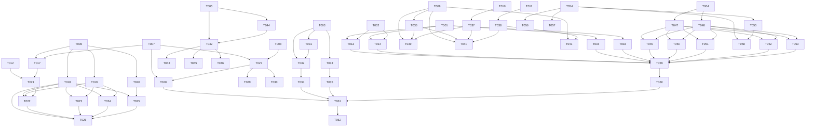

# Tasks: WebBoard Refactor — 浮叶 / WebLeaf

**Input**: Design documents from `spec/webboard-refactor/`
**Prerequisites**: plan.md, spec.md

**Organization**: Tasks are grouped by user story to enable independent implementation and testing of each story.

## Format: `[ID] [P?] [Story] Description`

- **[P]**: Can run in parallel (different files, no dependencies)
- **[Story]**: Which user story this task belongs to
- Include exact file paths in descriptions

## Path Conventions

- All paths are relative to `entry/src/main/ets/` unless prefixed otherwise
- Resource paths are relative to `entry/src/main/resources/` unless prefixed otherwise

---

## Phase 1: Setup (Shared Infrastructure)

**Purpose**: Project initialization, branding, permissions, and basic structure

- [X] T001 Update app name to "浮叶" in `AppScope/app.json5` (label) and `entry/src/main/module.json5`
- [X] T002 [P] Update app icon assets in `AppScope/resources/media/app_icon.png` and `entry/src/main/resources/base/media/`
- [X] T003 [P] Add `ohos.permission.FILE_ACCESS_PERSIST` to `entry/src/main/module.json5` requestPermissions
- [X] T004 [P] Create i18n resource directories: `entry/src/main/resources/en_US/element/string.json`
- [X] T005 [P] Update brand color resources in `entry/src/main/resources/base/element/color.json` (and create dark variant)

---

## Phase 2: Foundational (Blocking Prerequisites)

**Purpose**: Core infrastructure that MUST be complete before ANY user story can be implemented

**⚠️ CRITICAL**: No user story work can begin until this phase is complete

- [X] T006 Create `DatabaseManager` singleton class in `entry/src/main/ets/database/DatabaseManager.ets` (SQLite init, web_apps + settings tables)
- [X] T007 [P] Update `WebAppItem` model (`entry/src/main/ets/model/WebAppItem.ets`) — add `persistUri` and `persistMode` fields, update `fromRecord()`
- [X] T008 [P] Update `Constants.ets` (`entry/src/main/ets/common/Constants.ets`) — add `SourceType.URL = 'url'`, remove unused `AppColorsInterface` references
- [X] T009 [P] Create `ToastUtil` in `entry/src/main/ets/ui/ToastUtil.ets` (wrapper around `promptAction.showToast`)
- [X] T010 [P] Create `LoadingUtil` in `entry/src/main/ets/ui/LoadingUtil.ets` (global loading dialog via `openCustomDialog`)
- [X] T011 [P] Create `DialogUtil` in `entry/src/main/ets/ui/DialogUtil.ets` (confirm/alert dialogs via `openCustomDialog`)
- [X] T012 Remove deprecated `StorageManager` in `entry/src/main/ets/util/StorageManager.ets` (replaced by DatabaseManager)

**Checkpoint**: Foundation ready — user story implementation can now begin

---

## Phase 3: User Story 1 — 品牌焕新 (Priority: P1) 🎯

**Goal**: All user-facing references updated from "WebBoard" to "浮叶 / WebLeaf"

**Independent Test**: Navigation bar shows "浮叶", Settings "关于" section shows "浮叶 WebLeaf"

- [X] T013 [P] [US1] Update `Index.ets` — change Navigation title from "WebBoard" to "浮叶" in `entry/src/main/ets/pages/Index.ets`
- [X] T014 [P] [US1] Update `SettingsPage.ets` — change app description/version text from "WebBoard" to "浮叶 WebLeaf" in `entry/src/main/ets/pages/SettingsPage.ets`
- [X] T015 [P] [US1] Update `ImportPage.ets` — update title from "导入 HTML 应用" to "导入" in `entry/src/main/ets/pages/ImportPage.ets`
- [X] T016 [P] [US1] Update `EntryAbility.ets` — update any WebBoard references in `entry/src/main/ets/entryability/EntryAbility.ets`

---

## Phase 4: User Story 2 — SQLite 数据存储迁移 (Priority: P1) 🎯

**Goal**: All data operations migrated from Preferences to SQLite, old data cleared

**Independent Test**: Import an app → kill app → reopen → app persists in list

- [X] T017 [US2] Implement `DatabaseManager.init()` — create web_apps and settings tables in `entry/src/main/ets/database/DatabaseManager.ets`
- [X] T018 [P] [US2] Implement `DatabaseManager.getAllApps()` and `getAppById()` in `entry/src/main/ets/database/DatabaseManager.ets`
- [X] T019 [P] [US2] Implement `DatabaseManager.addApp()`, `updateApp()`, `deleteApp()` in `entry/src/main/ets/database/DatabaseManager.ets`
- [X] T020 [P] [US2] Implement `DatabaseManager.getSetting()` and `setSetting()` in `entry/src/main/ets/database/DatabaseManager.ets`
- [X] T021 [US2] Initialize DatabaseManager in `EntryAbility.ets` — call `DatabaseManager.getInstance(context).init()` in `onCreate()`
- [X] T022 [US2] Update `Index.ets` — replace `StorageManager` with `DatabaseManager` for app list operations in `entry/src/main/ets/pages/Index.ets`
- [X] T023 [US2] Update `ImportPage.ets` — replace `StorageManager` with `DatabaseManager` for save operations in `entry/src/main/ets/pages/ImportPage.ets`
- [X] T024 [US2] Update `EditPage.ets` — replace `StorageManager` with `DatabaseManager` for update operations in `entry/src/main/ets/pages/EditPage.ets`
- [X] T025 [US2] Update `SettingsPage.ets` — replace `StorageManager` with `DatabaseManager` for settings operations in `entry/src/main/ets/pages/SettingsPage.ets`
- [X] T026 [US2] Update `AppDataSource.ets` — adapt to new data flow in `entry/src/main/ets/model/AppDataSource.ets`

---

## Phase 5: User Story 3 — 网络纯 URL 引用 (Priority: P1)

**Goal**: URL import no longer downloads to local, stores URL reference directly

**Independent Test**: Import URL → open → Web loads page from network without local file

- [X] T027 [US3] Refactor `ImportPage.downloadFromUrl()` in `entry/src/main/ets/pages/ImportPage.ets` — remove download logic, store URL as `entryHtml` with `sourceType = SourceType.URL`
- [X] T028 [US3] Update `ViewerPage.ets` in `entry/src/main/ets/pages/ViewerPage.ets` — handle URL source type: pass URL string directly to Web component `src`, ensure `mixedMode(MixedMode.All)`, `fileAccess` conditional
- [X] T029 [US3] Update `Index.ets` preload logic in `entry/src/main/ets/pages/Index.ets` — skip preload for URL-type apps (only preload local files)
- [X] T030 [US3] Update `WebPreloader.ets` in `entry/src/main/ets/util/WebPreloader.ets` — add URL type detection, skip preloading for network sources

---

## Phase 6: User Story 4 — 文件持久化授权 (Priority: P2)

**Goal**: File import attempts persistent authorization via `ohos.fileshare.persistPermission`, falls back to sandbox copy

**Independent Test**: Select external HTML → kill app → reopen → still loads successfully

- [X] T031 [US4] Implement `FileManager.isPersistPermissionSupported()` — check `canIUse('SystemCapability.FileManagement.AppFileService.FolderAuthorization')` in `entry/src/main/ets/util/FileManager.ets`
- [X] T032 [US4] Implement `FileManager.tryPersistPermission(uri)` — call `fileShare.persistPermission()` with READ_MODE in `entry/src/main/ets/util/FileManager.ets`
- [X] T033 [US4] Implement `FileManager.activatePermissions(uris)` — call `fileShare.activatePermission()` to re-activate on app restart in `entry/src/main/ets/util/FileManager.ets`
- [X] T034 [US4] Update `ImportPage.handleSave()` — integrate persist permission attempt with fallback to `copyFileToWorkspace()` in `entry/src/main/ets/pages/ImportPage.ets`
- [X] T035 [US4] Add `activatePermissions` call in `EntryAbility.onCreate()` to restore file access on startup in `entry/src/main/ets/entryability/EntryAbility.ets`

---

## Phase 7: User Story 5 — 通用 UI 能力封装 (Priority: P2)

**Goal**: Global Toast/Loading/Dialog functions usable from any page

**Independent Test**: Call `Toast.show('test')`, `Loading.show()`, `Dialog.confirm(...)` from any page and verify display

- [X] T036 [P] [US5] Implement `ToastUtil` — export `Toast.show()` wrapper for `promptAction.showToast()` with success/error variants in `entry/src/main/ets/ui/ToastUtil.ets`
- [X] T037 [P] [US5] Implement `LoadingUtil` — export `Loading.show()` and `Loading.hide()` using `openCustomDialog` with Progress component in `entry/src/main/ets/ui/LoadingUtil.ets`
- [X] T038 [P] [US5] Implement `DialogUtil` — export `Dialog.confirm()` and `Dialog.alert()` using `openCustomDialog` with configurable buttons in `entry/src/main/ets/ui/DialogUtil.ets`
- [X] T039 [US5] Replace inline `showToast()` calls in `Index.ets` with `Toast.show()` in `entry/src/main/ets/pages/Index.ets`
- [X] T040 [US5] Replace inline promptAction calls in `ImportPage.ets` with `Toast`/`Dialog` utilities in `entry/src/main/ets/pages/ImportPage.ets`
- [X] T041 [US5] Replace inline showAlertDialog calls in `EditPage.ets` with `Dialog` utilities in `entry/src/main/ets/pages/EditPage.ets`

---

## Phase 8: User Story 6 — UI/UX 全面升级 (Priority: P2)

**Goal**: Modern visual design with brand identity, smooth animations, perfect dark/light mode adaptation

**Independent Test**: Switch system dark/light mode → all pages adapt seamlessly

- [X] T042 [P] [US6] Apply brand color system — update all `$r('app.color.*')` usages across all page `.ets` files to use new palette
- [X] T043 [P] [US6] Add page transition animations — add `transition()` and `animate()` effects to `Index.ets`, `ImportPage.ets` in `entry/src/main/ets/pages/`
- [X] T044 [P] [US6] Create dark theme color resources in `entry/src/main/resources/dark/element/color.json`
- [X] T045 [P] [US6] Improve layout spacing — consistent padding/margin across all pages, rounded corners, shadows in `entry/src/main/ets/pages/`
- [X] T046 [US6] Add gesture feedback — button press effects, list item tap ripple, pull-to-refresh polish in `Index.ets`

---

## Phase 9: User Story 7 — 国际化 (Priority: P3)

**Goal**: All UI strings support zh-CN and en-US, auto-switch with system language

**Independent Test**: Switch system language to English → all UI text in English

- [X] T047 [P] [US7] Create `string.json` for zh-CN (base) — define all app string resources in `entry/src/main/resources/base/element/string.json`
- [X] T048 [P] [US7] Create `string.json` for en-US — English translations in `entry/src/main/resources/en_US/element/string.json`
- [X] T049 [US7] Replace all hardcoded strings in `Index.ets` with `$r('app.string.*')` references in `entry/src/main/ets/pages/Index.ets`
- [X] T050 [US7] Replace all hardcoded strings in `ImportPage.ets` with `$r('app.string.*')` references in `entry/src/main/ets/pages/ImportPage.ets`
- [X] T051 [US7] Replace all hardcoded strings in `ViewerPage.ets` with `$r('app.string.*')` references in `entry/src/main/ets/pages/ViewerPage.ets`
- [X] T052 [US7] Replace all hardcoded strings in `EditPage.ets` with `$r('app.string.*')` references in `entry/src/main/ets/pages/EditPage.ets`
- [X] T053 [US7] Replace all hardcoded strings in `SettingsPage.ets` with `$r('app.string.*')` references in `entry/src/main/ets/pages/SettingsPage.ets`

---

## Phase 10: User Story 8 — 代码结构与性能优化 (Priority: P3)

**Goal**: Clean code structure, improved Web preloader, smooth list performance

**Independent Test**: List of 20+ apps scrolls smoothly, preloaded apps open faster

- [X] T054 [P] [US8] Create `Logger.ets` in `entry/src/main/ets/common/Logger.ets` — unified logging utility replacing inline `console.error`
- [X] T055 [P] [US8] Replace all `console.error` calls across all `.ets` files with `Logger.error()` in `entry/src/main/ets/`
- [X] T056 [US8] Optimize `WebPreloader.ets` — add LRU eviction, memory limit enforcement in `entry/src/main/ets/util/WebPreloader.ets`
- [X] T057 [US8] Optimize list rendering in `Index.ets` — add `cachedCount` to LazyForEach, reduce unnecessary re-renders in `entry/src/main/ets/pages/Index.ets`
- [X] T058 [US8] Remove unused imports and dead code across all `.ets` files in `entry/src/main/ets/`

---

## Phase 11: Polish & Cross-Cutting Concerns

**Purpose**: Final cleanup and cross-cutting improvements

- [X] T059 Verify all `import` paths are correct after file renames/moves across `entry/src/main/ets/`
- [X] T060 Update `WorkDirectory.ets` — remove dependency on deleted `StorageManager` in `entry/src/main/ets/util/WorkDirectory.ets`

---

## Phase 12: Verification

<!-- verification_scope: build-only -->

**Purpose**: Build and deploy verification

- [X] T061 Build project and fix any compilation errors (invoke `build_project`; iterate fix → build until success)
- [X] T062 Deploy application to device/emulator (invoke `start_app`)

---

## 📊 Dependency Graph

## ⚡ Parallel Execution Guide

| Phase | Tasks | Required Files | Execution Notes |
|-------|-------|----------------|-----------------|
| Setup | T002, T003, T004, T005 | `app.json5`, `module.json5`, icons, resources | All independent, run simultaneously |
| Foundational | T007, T008, T009, T010, T011 | `WebAppItem.ets`, `Constants.ets`, `*Util.ets` | All independent, run simultaneously |
| US1 (Brand) | T013, T014, T015, T016 | `Index.ets`, `SettingsPage.ets`, `ImportPage.ets`, `EntryAbility.ets` | All independent, run simultaneously |
| US2 (SQLite) | T018, T019, T020 | `DatabaseManager.ets` methods | All independent methods |
| US5 (UI Utils) | T036, T037, T038 | `ToastUtil.ets`, `LoadingUtil.ets`, `DialogUtil.ets` | All independent |
| US7 (i18n) | T047, T048 | `string.json` resources | All independent |
| US7 (i18n implementation) | T049, T050, T051, T052, T053 | All page files | All independent |
| US8 (Perf) | T054, T056, T057 | `Logger.ets`, `WebPreloader.ets`, `Index.ets` | All independent |

## Implementation Strategy

### MVP Scope (User Stories 1 + 2 + 3 — P1 items)
1. Complete Phase 1: Setup (T001–T005)
2. Complete Phase 2: Foundational (T006–T012)
3. Complete Phase 3: US1 — Brand (T013–T016)
4. Complete Phase 4: US2 — SQLite (T017–T026)
5. Complete Phase 5: US3 — URL Import (T027–T030)
6. **MVP VALIDATE**: Test P1 stories independently
7. Proceed to P2 items (US4, US5, US6)
8. Final: P3 items (US7, US8) + Polish + Verification

### User Story Dependencies

- **US1 (Brand)**: Depends on Setup — No story dependencies
- **US2 (SQLite)**: Depends on Foundational — No story dependencies
- **US3 (URL Import)**: Depends on Foundational (DatabaseManager + model updates) — No story dependencies
- **US4 (Persist Auth)**: Depends on Foundational (model updates) + US2 partially — Independent from US3
- **US5 (UI Utils)**: Depends on Foundational — No story dependencies, can be done in parallel with US1–US4
- **US6 (UI/UX)**: Depends on Setup (brand colors) — Minimal story dependencies
- **US7 (i18n)**: Depends on Setup (resource dirs) — No story dependencies
- **US8 (Perf)**: Depends on Foundational — No story dependencies

## Summary Report

| Category | Count |
|----------|-------|
| **Total Tasks** | 62 |
| **Setup (Phase 1)** | 5 |
| **Foundational (Phase 2)** | 7 |
| **US1 — Brand (P1)** | 4 |
| **US2 — SQLite (P1)** | 10 |
| **US3 — URL Import (P1)** | 4 |
| **US4 — Persist Auth (P2)** | 5 |
| **US5 — UI Utils (P2)** | 6 |
| **US6 — UI/UX (P2)** | 5 |
| **US7 — i18n (P3)** | 7 |
| **US8 — Performance (P3)** | 5 |
| **Polish** | 2 |
| **Verification** | 2 |
| **Parallel Opportunities** | 20+ tasks |
| **MVP Tasks (P1 only)** | 30 |
